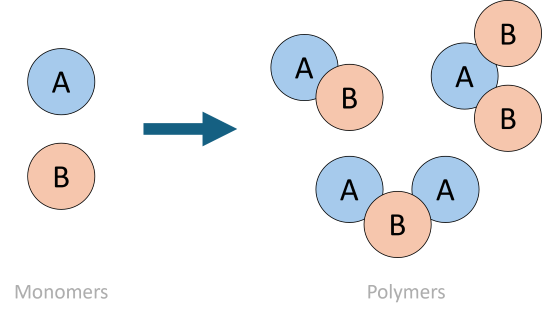
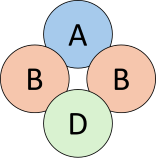

# COFFEE: Convex Optimization for Free Energy Equilibria
a High-Performance Approach to Convex Optimization for Thermodynamic Equilibrum Computations

University of Texas at Austin Electrical & Computer Engineering
Senior Design Group Faculty Honors (FH) 12 | Aug 2024 - May 2025

Paul Bessler, Jeffrey Geng, Yash Mittal, Aamir Mohsin, Sahil Shah, Arnav Vats, Fu-Yao (Jefferson) Yu

## About 
Given the input concentrations and free energies of molecules,
COFFEE calculates the resulting equilibrium output concentration
of the formations.
- COFFEE is designed to be molecule-agnostic
and scalable, leveraging a novel application of trust-region
optimization methods.
- COFFEE introduces a high-performance
Rust approach and supports both command-line and web-based
interfaces.
- Extensive evaluations against the current state-of-the-
art demonstrates an improvement of up to 7 orders of magnitude
in constraint adherence and a 2-fold increase in execution speed
for large inputs. 

## Getting Started
To get a local copy up and running, follow these steps.

Alternatively, you can view a demo version at [https://coffeesolver.dev](https://coffeesolver.dev). For high-performance use cases, we recommend running COFFEE locally. 

### Prerequisites
Install Rust on your machine from https://www.rust-lang.org/.

### Build

To build the `coffee-cli` executable, perform the following:

1. Navigate to the `crates/coffee-cli` directory and run:

```bash
cargo build --release
```

Note that we do not recommend using `cargo run`, as it runs a development version instead of a higher-performant release version.

### Run the CLI

1. After building the executable target, navigate to the directory of the executable. (From root, the executable filepath should be as below, but this may be dependent on your machine.)
```bash
# from root
cd crates/coffee-cli/target/release
```

2. Run the executable, providing filepaths to the CFE and CON inputs.

```bash
./coffee-cli <file_path_cfe> <file_path_con>
```

**Example:**
```bash
./coffee-cli ../../testcases/0/input.ocx ../../testcases/0/input.con
./coffee-cli ../../testcases/1/input.ocx ../../testcases/1/input.con
```

### Optional Args

#### Verbose

This flag adds additional information to the output, including an elapsed time field.

- Short Form: ```-v```
- Long Form: ```-verbose```
- Default: off

**Example:**

```bash
./coffee-cli ../../testcases/0/input.ocx ../../testcases/0/input.con -v
```

### Log Redirection

This flag redirects the log and the results to a specified output file. If this flag is not provided, log will print to stdout by default.

- Short Form: ```-l <file_path>```
- Long Form: ```-log <file_path>```
- Default: logs to stdout

**Example:**

```bash
./coffee-cli ../../testcases/0/input.ocx ../../testcases/0/input.con -l output.txt
```

### Output Redirection

This flag redirects the results to a specified output file. If this flag is not provided, results will not be saved to a file and will print to stdout.

- Short Form: ```-o <file_path>```
- Long Form: ```-output <file_path>```
- Default: outputs to stdout

**Example:**

```bash
./coffee-cli ../../testcases/0/input.ocx ../../testcases/0/input.con -o output.txt
```

## Design Methodology
### Introductory Math

- $n$: Total number of polymers.  
- $m$: Total number of monomers.  
- $x$: Equilibrium concentration of polymers, where $x \in \mathbb{R}^n$.  
- $\lambda$: Lagrange multipliers, where $\lambda \in \mathbb{R}^m$.  
- $x^0$: Initial concentrations of monomers, where $x^0 \in \mathbb{R}^m$.  
- $\Omega$: Logarithmic polymer free energies, where $\Omega \in \mathbb{R}^n$.  
- $A$: Matrix relating monomer and polymer concentrations, where $A \in \mathbb{R}^{m \times n}$;  
  the entry $a_{ij}$ in matrix $A$ represents the number of monomer $i$ in polymer $j$.

Recall the convex optimization problem:

$$
\begin{aligned}
    &\text{Maximize} \quad & f(x) &\equiv \sum_{j \in n} x_j \left( \log x_j - \log \Omega_j - 1 \right) \\
    &\text{Subject to} \quad & Ax &= x^0
\end{aligned}
$$

This is the basis of the function that we will begin to simplify using Lagrangians so that it can be solved efficiently. For further explanation, read our research paper. 

## Inputs and Input Formatting

COFFEE takes two inputs: a Composition + Free Energies input and a Concentrations input.

### Input: Composition and Free Energies

The Composition + Free Energies input (hence denoted as CFE) represents a matrix describing the chemical composition of each polymer and its free energy. Each row describes one polymer. The main section of the matrix comprises of integers representing the number of monomers that make up that polymer.

<div style="text-align: center;">
  
</div>

For instance, a polymer represented by `A1 B2 D1` could be represented by:
```
...  1   2   0   1  ...
```

<div style="text-align: center;">
  
</div>


This CFE can be provided in two ways:
1. A file, including .ocx, .csv, .tsv, .txt, or .cfe.
2. The pasted contents representing the CFE.

In the CFE input, all values before the last column must be non-negative integers. The last column supports decimal form or scientific notation. COFFEE supports the use of tabs, spaces, commas, semicolons, and pipes as delimiters. The delimiter choice is automatically detected.

Note that the following CFE examples are used for labeling purposes. **For properly formatted CFE examples with delimiter usage, reference the example inputs in the `testcases` directory.**

**Conventional Example:**
```
|             Polymer Composition             |       Free Energy      |
|---------------------------------------------|------------------------|
| 0  1  1  0  0  0  0  0  0  0  0  0  0  0  0 | -9.004860830633739e+2  |
| 1  0  1  0  0  0  1  1  1  0  0  0  0  0  0 | -1.801944332253496e+3  |
| 2  0  0  0  0  0  2  2  0  0  0  0  0  0  0 | -1.2036624531343473e+3 |
| 2  0  0  0  0  0  2  0  2  0  0  0  0  0  0 | -1.2036624531343473e+3 |
| 2  0  0  0  0  0  0  2  2  0  0  0  0  0  0 | -1.2036624531343473e+3 |
| 0  2  0  0  0  0  0  0  0  0  0  0  2  2  0 | -1.2036624531343473e+3 |
| 0  2  0  0  0  0  0  0  0  0  0  0  2  0  2 | -1.2036624531343473e+3 |
| 0  2  0  0  0  0  0  0  0  0  0  0  0  2  2 | -1.2036624531343473e+3 |
| 0  2  0  0  0  0  0  0  0  0  0  0  2  0  0 | -6.02279607735107e+2   |
| 0  2  0  0  0  0  0  0  0  0  0  0  0  2  0 | -6.02279607735107e+2   |
```

**NUPACK Example:**
```
| Row Number | NUPACK Format |                Polymer Composition             |       Free Energy      |
|------------|---------------|------------------------------------------------|------------------------|
| 1          | 1             | 0  1  1  0  0  0  0  0  0  0  0  0  0  0  0  0 | -9.004860830633739e+2  |
| 2          | 1             | 1  0  1  0  0  0  0  1  1  0  0  0  0  0  0  0 | -1.801944332253496e+3  |
| 3          | 1             | 2  0  0  0  0  0  2  2  0  0  0  0  0  0  0  0 | -1.2036624531343473e+3 |
| 4          | 1             | 2  0  0  0  0  0  2  0  2  0  0  0  0  0  0  0 | -1.2036624531343473e+3 |
| 5          | 1             | 2  0  0  0  0  0  0  2  2  0  0  0  0  0  0  0 | -1.2036624531343473e+3 |
| 6          | 1             | 0  2  0  0  0  0  0  0  0  0  0  0  0  2  2  0 | -1.2036624531343473e+3 |
| 7          | 1             | 0  2  0  0  0  0  0  0  0  0  0  0  0  2  0  2 | -1.2036624531343473e+3 |
| 8          | 1             | 0  2  0  0  0  0  0  0  0  0  0  0  0  0  2  2 | -1.2036624531343473e+3 |
| 9          | 1             | 0  2  0  0  0  0  0  0  0  0  0  0  0  2  0  0 | -6.02279607735107e+2   |
| 10         | 1             | 0  2  0  0  0  0  0  0  0  0  0  0  0  0  2  0 | -6.02279607735107e+2   |
```

### Input: Concentrations

The CON (concentrations) input contains the concentrations of the monomers.

The CON input can be provided in two ways:
1. A file, including .con, .txt, .csv, or .tsv.
2. The pasted contents representing the CONs.

COFFEE supports concentration values separated by a new line character in either decimal form or scientific notation.

**Example:**
```
| Polymer Concentration  |
|------------------------|
| 1.0000000000000002e-6  |
| 9.000000000000001e-7   |
| 4.0000000000000003e-7  |
| 2.0000000000000002e-7  |
| 2.0000000000000002e-7  |
| 2.0000000000000002e-7  |
| 7.000000000000001e-7   |
| 7.000000000000001e-7   |
| 7.000000000000001e-7   |
| 2.0000000000000002e-7  |
```

### Outputs

COFFEE provides the following outputs to users:

**Optimal_X**:

Optimal_X represents the polymer values that maximize our objective function while satisfying constraints. It’s the decision variable that gives the best possible outcome given the imposed restrictions.

**Optimal_Value**:

Optimal_Value represents the maximum value achieved when Optimal_X is substitued into the objective function. This represents the best outcome achievable under the given constraints.

**Concenntration_Constraint_Error**:

The Concentration Constraint Error measures of how well COFFEE's computation follows the conservation of mass constraint and matches real world conditions. Values closer to 0 represent a more realistic result, with values under 1e-15 being optimal.

**Graph Viewer** (web version)

COFFEE provides two forms to visualize results.

1. *Iteration Data*: This figure is a line graph that displays the progression of the maximization function across iterations of the computation equation.
2. *Concentration Data*: This figure is a pie chart that shows the polymers with the five highest concentrations in the equilibrium result. Remaining polymers are combined into an 'other' slice of the pie.


## Using the `COFFEE` Crate in your Project

### 1. Add the Dependency

In your root `Cargo.toml`, include the following:

```toml
coffee = { path = "crates/coffee" }
```

---

### 2. Import Required Code

#### **`run_coffee_computation`**

- **Description**: Executes the convex optimization problem.
- **Import**:  
  ```rust
  use coffee::run_coffee_computation;
  ```
- **Arguments**:
  - **file_path_cfe**: `&str`  
  - **file_path_con**: `&str`  
  - **optimizer_args**: `&OptimizerArgs`
- **Returns**:  
  `Result<OptimizerResults, Box<dyn Error>>`

#### **`OptimizerArgs`**

- **Description**: Contains optional parameters for the optimizer. These parameters allow customization of the optimization process. All parameters have default values, which can be overridden.
- **Import**:  
  ```rust
  use coffee::extras::OptimizerArgs;
  ```

- **Fields**:
  - **max_iterations**: `usize`  
  - **max_delta**: `f64`  
  - **eta**: `f64`  
  - **norm_ratio_threshold**: `f64`  
  - **rho_thresholds**: `[f64; 2]`  
  - **scale_factors**: `[f64; 2]`  
  - **use_terminal**: `bool`  
  - **scalarity**: `bool`  
  - **temp_celsius**: `f64`  
  - **verbose**: `bool`  

- **Example Initialization**:
  ```rust
  let optimizer_args = OptimizerArgs {
      ..OptimizerArgs::default()
  };
  ```

---

### 3. Format the Result

`run_coffee_computation` returns an `OptimizerResults` struct that contains the output of the computation.

```rust
pub struct OptimizerResults {
    pub optimal_x: Vec<f64>,
    pub optimal_lagrangian: f64,
    pub optimal_lambda: Vec<f64>,
    pub concentration_error: f64,
    pub log_messages: Vec<String>,
    pub elapsed_time: usize,
}
```

You can use the data members directly for specific use cases.

#### Optional: Format the Output

To produce a human-readable summary of the results, import and use the `results_message` function:

- **Import**:  
  ```rust
  use coffee::format::results_message;
  ```
- **Usage**:
  ```rust
  let message = results_message(&results);
  println!("{}", message);
  ```

